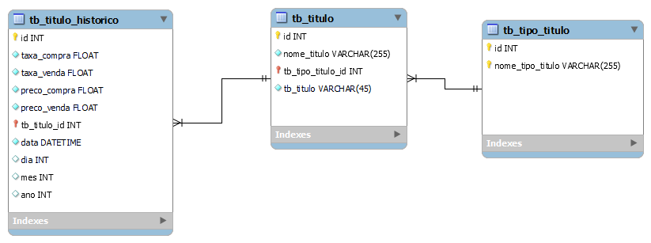

# Modelos treinados para classificação e regressão de taxa de rendimento de títulos do tesouro direto

Modelos treinados para classificação e regressão de taxa de rendimento na venda em curto prazo de títulos do tesouro direto com base em indicadores calculados.

- Consistiu das seguintes etapas:
  - Extração os dados dos arquivos de preços e taxas:
    - 'https://cdn.tesouro.gov.br/sistemas-internos/apex/producao/sistemas/sistd/2023/LTN_2023.xls',
    - 'https://cdn.tesouro.gov.br/sistemas-internos/apex/producao/sistemas/sistd/2023/NTN-C_2023.xls',
    - 'https://cdn.tesouro.gov.br/sistemas-internos/apex/producao/sistemas/sistd/2023/NTN-B_2023.xls',
    - 'https://cdn.tesouro.gov.br/sistemas-internos/apex/producao/sistemas/sistd/2023/NTN-F_2023.xls',
    - 'https://cdn.tesouro.gov.br/sistemas-internos/apex/producao/sistemas/sistd/2023/LFT_2023.xls',
    - 'https://cdn.tesouro.gov.br/sistemas-internos/apex/producao/sistemas/sistd/2023/NTN-B_Principal_2023.xls'
  - Criação da base de dados no sqlite:
    -  
    - Os dados sobre títulos do Tesouro Direto brasileiro fornecem informações específicas sobre um título:
      - data: refere-se à data em que os valores foram registrados ou atualizados.
      - taxa_compra: indica a taxa de compra associada ao título na data específica.
      - taxa_venda: representa a taxa de venda associada ao título na data específica.
      - preco_compra: refere-se ao preço de compra do título nessa data específica.
      - preco_venda: indica o preço de venda do título na data em questão.
      - preco_base: representa o preço base do título.
      - nome_titulo: corresponde ao nome ou descrição do título do Tesouro Direto. Essa informação fornece detalhes sobre o tipo de título e seu vencimento.
  - Montagem da base de treino e teste com os indicadores calculados para treinamento do modelo de regressão e classificação;
  - Avaliação do modelo.

